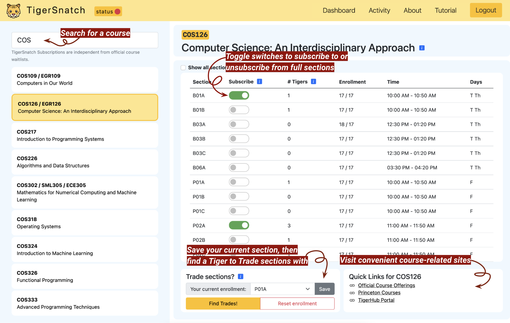
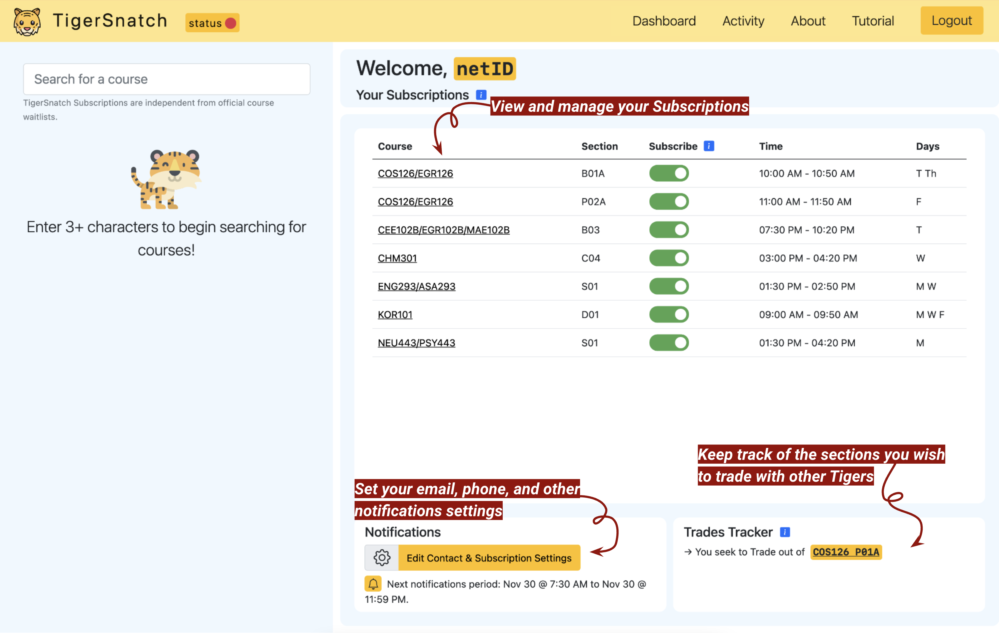
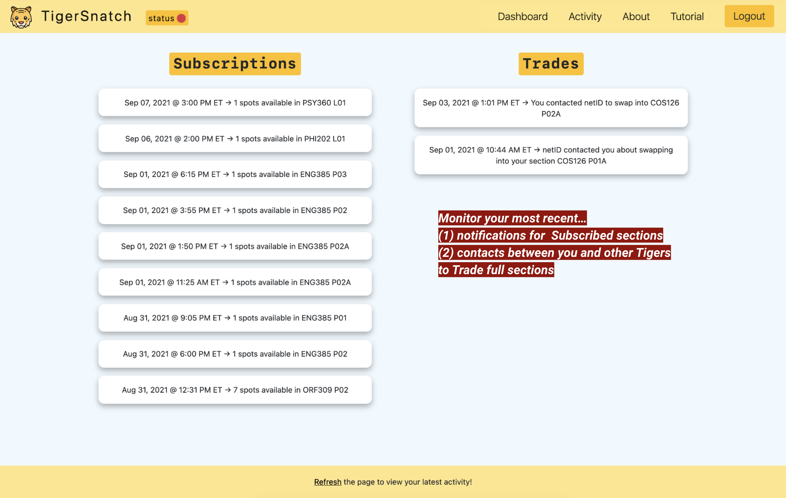

# Welcome to TigerSnatch!

[TigerSnatch](https://tigersnatch.com) helps Princeton students with course enrollment through its Subscriptions and Trades features. With Subscriptions, students can receive an email and text message when spots open in a full course, so they can avoid repeatedly checking official Course Offerings. TigerSnatch Trades, a first-of-its-kind system at Princeton, connects students who want to switch into each other's full sections.

> TigerSnatch began as a Spring '21 COS333 project at Princeton University by Shannon Heh '23, Nicholas Padmanabhan '23, and Byron Zhang '23.

---

    

        Tutorial
    

    

        

        Before you start Snatching for course spots, here’s a brief guide on how to use
        TigerSnatch.
        

        

        Don't forget to set your Contact & Subscription Settings (e.g. your phone number used for
        text messages) in the Notifications box on the Dashboard!
        

    

    

        

        Search for courses by department, number, and/or title.
        

    

    

        

        Toggle “Subscribe” switches to activate or deactivate email and text message notifications
        for spot openings in specific course sections.
        

    

    

        

        If you're already enrolled in a full section but wish to switch into another, use Trades.
        From the dropdown, select and save your currently enrolled section. Then, click Find
        Trades to view and contact other Tigers who are enrolled in a section you want (i.e. one
        of your Subscriptions) and who are subscribed to your currently enrolled section.
        

    

    

        

        
        

    

    

        

        Return to the Dashboard to check out your Subscriptions and the sections you wish to trade
        with other Tigers.
         
        

    

    

        

        
        

    

    

        

        It's that simple! The next time a spot opens up in a subscribed section, you'll be
        notified immediately via email and text message. If you didn't get the spot, just
        resubscribe on TigerSnatch to get notified when spots open again. To unsubscribe from a
        section, simply toggle the section's switch off in the Dashboard.
        

    

    

        

        View statistics about TigerSnatch and track your most recent Subscriptions and Trades
        notifications on the Activity page. Also, to learn more about improvements to TigerSnatch, check out
        Release Notes on the About page!
        

    

    

        

        
        

    

    

        

        TigerSnatch Subscriptions are independent from official course waitlists. You might not be
        able to enroll in courses shown on TigerSnatch even if spots free up. Always check Course
        Offerings for course-specific enrollment and waitlist info.
        

    

---

    

        

            Original Team
        

    

    

        

        
        <h2 class="fs-4 text-center pt-4 pb-0">Shannon Heh '23</h2>
        

        

        
        <h2 class="fs-4 text-center pt-4 pb-0">Nicholas Padmanabhan '23</h2>
        

        

        
        <h2 class="fs-4 text-center pt-4 pb-0">Byron Zhang '23</h2>
    

<link href="https://cdn.jsdelivr.net/npm/bootstrap@5.0.0-beta3/dist/css/bootstrap.min.css" rel="stylesheet" integrity="sha384-eOJMYsd53ii+scO/bJGFsiCZc+5NDVN2yr8+0RDqr0Ql0h+rP48ckxlpbzKgwra6" crossorigin="anonymous" />
<link rel="stylesheet" type="text/css" href="static/styles.min.5.0.css" />