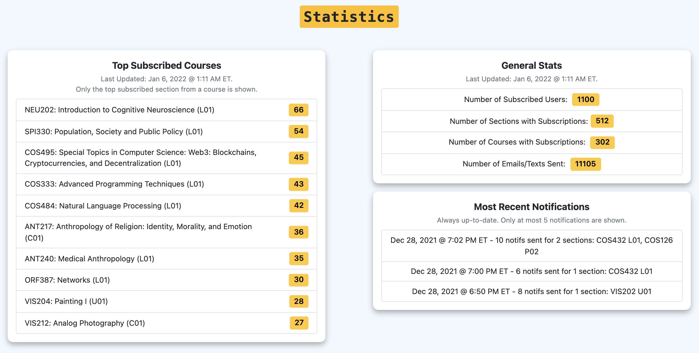

**What are Release Notes?**

Release Notes are our way of documenting and announcing new product updates (e.g. new features, feature upgrades, major bug fixes) to TigerSnatch users. Our release notes are published on the About page and on our Github repo in `RELEASE_NOTES.md`.

For Devs: For instructions on how to add release note, check `README_DEV.md`.

<!-- NOTE -->
## New "Statistics" Display under Activity page - 12 / 01 / 2021

<!-- BODY -->
**Introducing the new “Statistics” section on the Activity page!  With Statistics, users can learn more about the TigerSnatch system as a whole via insightful, up-to-date metrics.**

Under Statistics, users can view statistics including the most-subscribed courses across TigerSnatch, the total number of subscribed users, the total number of sections and courses with subscriptions. Users can also monitor the feed of most recent notifications to see the sections for which open-spot notifications were just sent.

Let us know if there are other data you’d like to see under Statistics via our Feedback form (in About)!

